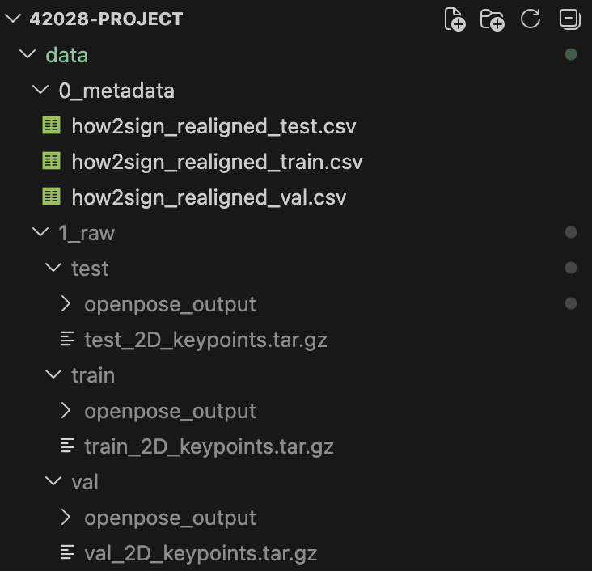

# 42028 Project: Sign Language Translation

## Overview

This project implements a **Sequence-to-Sequence (Seq2Seq)** model designed to translate American Sign Language (ASL) skeletal data into English text.

### Model Architecture:

- **Encoder:** Bi-directional LSTM that processes 134-feature skeletal keypoints.
- **Decoder:** LSTM with word-level embeddings to generate English sentences.
- **Optimization:** Adam optimizer with Cross-Entropy Loss (ignoring padding).
- **Hardware Support:** Auto-detects **Apple Silicon (MPS)**, **NVIDIA (CUDA)**, or **CPU**.

---

## Setup & Installation

### 1. Requirements

Ensure you have Python 3.10+ installed. Install dependencies using:

```bash
pip install torch numpy pandas tqdm
```

### 2. Dataset Preparation

Find the datasets (training, validation, and testing) at the Kaggle link below:
https://www.kaggle.com/datasets/nazarboholii/how2sign/data

1. **Metadata:** Download the realigned CSV files and put them in **data/0_metadata/**.
2. **Raw Data:** Put the downloaded datasets into **data/1_raw/** and extract them.
   - Expected structure: data/1_raw/train_npy/, data/1_raw/val_npy/, etc.

Please follow this folder structure like the following screenshot:



### 3. Preprocessing

Run the following scripts from the project root to prepare the tensors and vocabulary:

```bash
python3 src/preprocess.py
python3 src/vocab.py
python3 src/dataset.py
```

---

## Training

To start the full training run (31,047 specimens):

### CMD: python3 -m src.train

- **Checkpoints:** The best model weights will be saved automatically to **models/checkpoints/best_sign_model.pth**.
- **Memory Management:** For Mac M-series users, the script includes logic to clear the MPS cache to prevent Out-of-Memory (OOM) errors.

---

## Hardware Compatibility

The code is hardware-agnostic and will scale based on your machine:

- **Mac M1/M2/M3:** Uses **MPS** (Metal Performance Shaders).
- **NVIDIA GPU:** Uses **CUDA**.
- **Standard Laptop:** Defaults to **CPU**.
